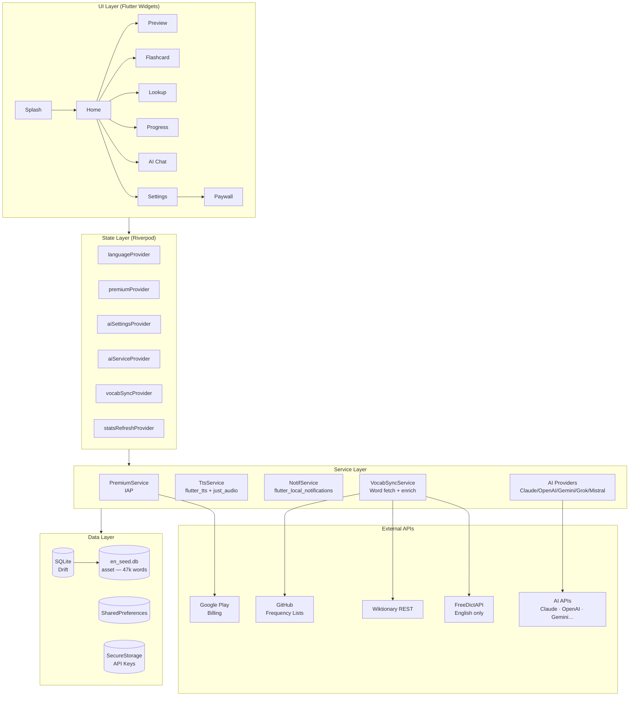
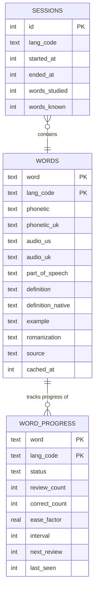
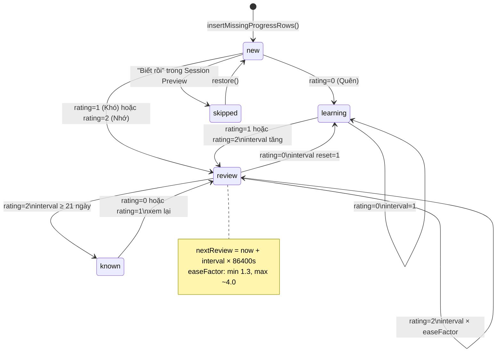
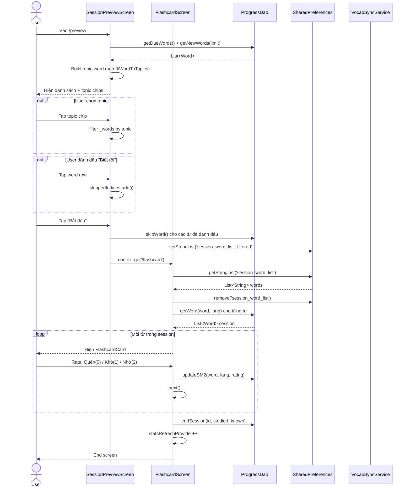
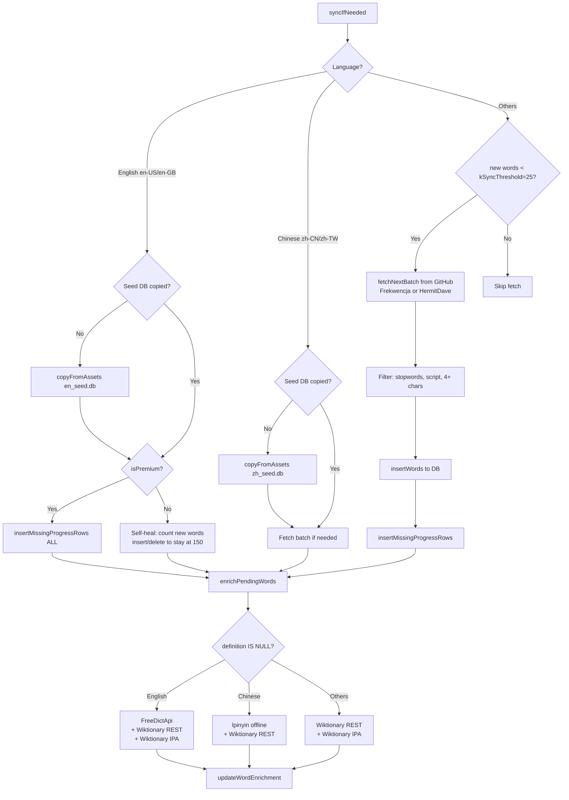
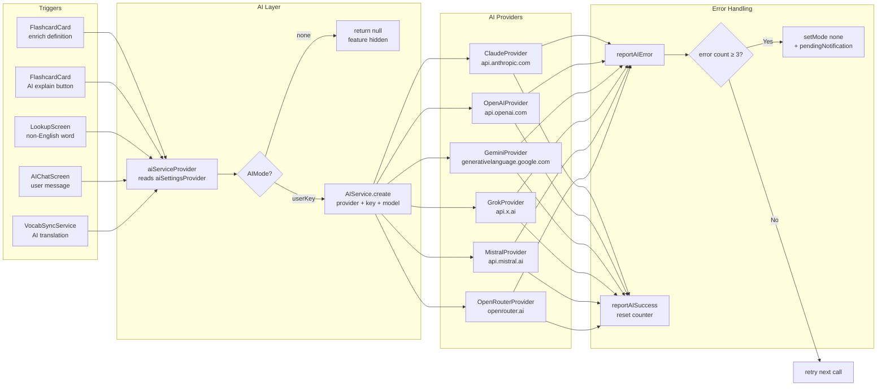
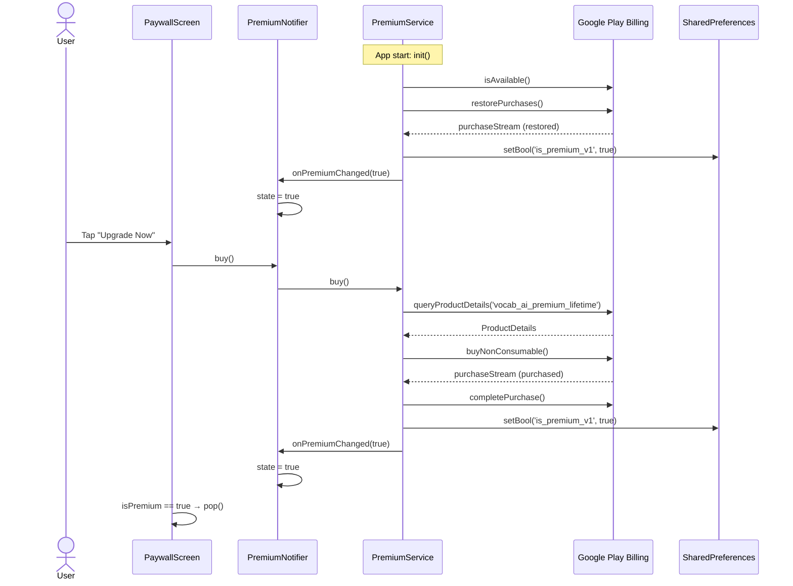
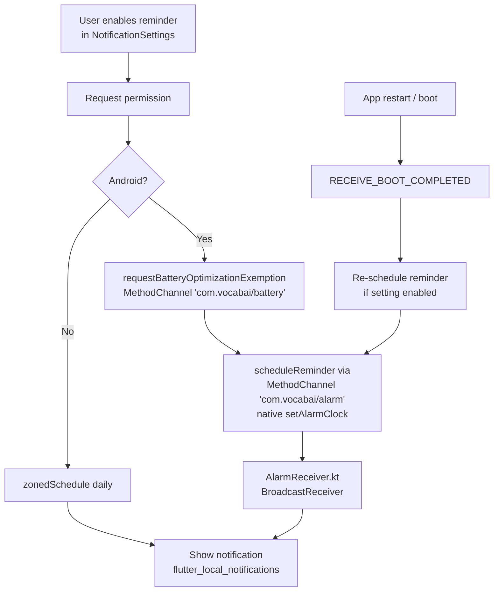
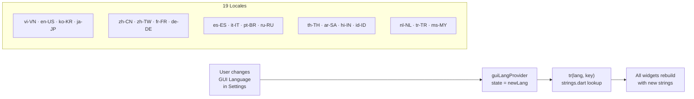

# Vocab AI — Software Architecture & Feature Documentation

> **Stack**: Flutter 3.x · Riverpod · Drift/SQLite · Dio · flutter_tts · just_audio · go_router · in_app_purchase

---

## Table of Contents

1. [Folder Structure](#1-folder-structure)
2. [Bootstrap & Initialization](#2-bootstrap--initialization)
3. [Database Layer](#3-database-layer)
4. [Core Services](#4-core-services)
5. [AI Layer](#5-ai-layer)
6. [Features](#6-features)
7. [State Management](#7-state-management)
8. [Diagrams](#8-diagrams)

---

## 1. Folder Structure

```
lib/
├── main.dart                    # Entry point, bootstrap
├── app.dart                     # MaterialApp + GoRouter config
├── core/
│   ├── providers.dart           # Global Riverpod providers
│   ├── db/
│   │   ├── tables.dart          # Drift table definitions
│   │   ├── database.dart        # AppDatabase (seed DB copy-on-first-run)
│   │   ├── word_dao.dart        # Word CRUD + enrichment queries
│   │   └── progress_dao.dart    # SM-2 progress + session queries
│   ├── vocab_sync/
│   │   └── vocab_sync_service.dart  # Word fetching, enrichment, free limit
│   ├── premium/
│   │   ├── premium_service.dart     # IAP wrapper (singleton)
│   │   └── premium_notifier.dart    # Riverpod StateNotifier
│   ├── ai/
│   │   ├── ai_service.dart          # Abstract interface + factory
│   │   ├── ai_settings.dart         # AISettings model + notifier
│   │   └── providers/               # Claude, OpenAI, Gemini, Grok, Mistral, OpenRouter
│   ├── tts/
│   │   └── tts_service.dart         # flutter_tts + just_audio wrapper
│   ├── notifications/
│   │   └── notif_service.dart       # Local notifications + native alarm
│   ├── theme/
│   │   └── app_theme.dart           # 6 color themes, AppColorScheme extension
│   └── l10n/
│       └── strings.dart             # 19-language string map + tr() helper
├── data/
│   ├── languages.dart               # 19 supported study languages
│   └── en_topics.dart               # Topic → word list (16 topics, ~1400 words)
├── features/
│   ├── splash/                      # SplashScreen (animated intro)
│   ├── session_preview/             # Word list preview + topic filtering
│   ├── flashcard/                   # Main study screen + card widget
│   ├── lookup/                      # Standalone dictionary lookup
│   ├── progress/                    # Stats dashboard + charts
│   ├── ai_chat/                     # Multi-turn AI conversation
│   ├── settings/                    # App settings, AI config, notifications
│   └── premium/                     # Paywall bottom sheet
└── widgets/
    └── main_screen.dart             # Home dashboard widget
```

---

## 2. Bootstrap & Initialization

**`main.dart`** — khởi chạy theo thứ tự:

```
1. WidgetsFlutterBinding.ensureInitialized()
2. Load SharedPreferences (lang, theme, AI settings)
3. TtsService.init()          — khởi tạo flutter_tts + just_audio player
4. NotifService.init()        — tạo notification channel, cấu hình timezone
5. PremiumNotifier._init()    — loadCached() + listen IAP purchase stream
6. NotifService.reschedule()  — đặt lại reminder sau khi app restart
7. runApp(UncontrolledProviderScope(...))
```

**Route map** (`app.dart`):

| Path | Screen |
|------|--------|
| `/` | SplashScreen |
| `/home` | MainScreen (Home Dashboard) |
| `/preview` | SessionPreviewScreen |
| `/flashcard` | FlashcardScreen |
| `/lookup` | LookupScreen |
| `/ai-chat` | AIChatScreen |
| `/progress` | ProgressScreen |
| `/settings` | SettingsScreen |

---

## 3. Database Layer

### Schema

#### `words` table
| Column | Type | Ghi chú |
|--------|------|---------|
| `word` | TEXT PK | Composite PK với `lang_code` |
| `lang_code` | TEXT PK | VD: `en-US`, `ko-KR` |
| `phonetic` | TEXT? | IPA (US) |
| `phonetic_uk` | TEXT? | IPA (UK) |
| `audio_us` | TEXT? | URL MP3 US |
| `audio_uk` | TEXT? | URL MP3 UK |
| `part_of_speech` | TEXT? | noun, verb, adj… |
| `definition` | TEXT? | Định nghĩa tiếng Anh |
| `definition_native` | TEXT? | Định nghĩa dịch sang ngôn ngữ user (AI) |
| `example` | TEXT? | Câu ví dụ |
| `romanization` | TEXT? | Pinyin (tiếng Trung) |
| `source` | TEXT | `local` · `api` · `remote` · `linked` |
| `cached_at` | INTEGER? | Unix timestamp |

#### `word_progress` table
| Column | Type | Ghi chú |
|--------|------|---------|
| `word` | TEXT PK | |
| `lang_code` | TEXT PK | |
| `status` | TEXT | `new` · `learning` · `review` · `known` · `skipped` |
| `review_count` | INTEGER | Tổng số lần ôn |
| `correct_count` | INTEGER | Số lần nhớ đúng |
| `ease_factor` | REAL | SM-2 ease (default 2.5) |
| `interval` | INTEGER | Số ngày đến lần ôn tiếp |
| `next_review` | INTEGER? | Unix timestamp |
| `last_seen` | INTEGER? | Unix timestamp |

#### `sessions` table
| Column | Type | Ghi chú |
|--------|------|---------|
| `id` | INTEGER PK autoincrement | |
| `lang_code` | TEXT | |
| `started_at` | INTEGER | Unix timestamp |
| `ended_at` | INTEGER? | |
| `words_studied` | INTEGER | |
| `words_known` | INTEGER | |

### SM-2 Algorithm (`updateSM2`)

```
Rating 0 (Quên):   interval = 1,  easeFactor -= 0.2,  status = 'learning'
Rating 1 (Khó):    interval = max(1, prev * 1.2),  easeFactor -= 0.15,  status = 'review'
Rating 2 (Nhớ):    interval = prev * easeFactor,   easeFactor += 0.1,   status = 'review'/'known'
                   → status = 'known' khi interval >= 21 ngày
nextReview = now + interval * 86400
```

---

## 4. Core Services

### VocabSyncService

**Hằng số:**
```dart
kSyncThreshold     = 25    // Còn ít hơn N từ → fetch batch mới
kBatchSize         = 50    // Số từ mỗi lần fetch
kMaxWords          = 5050  // Giới hạn từ per language
kFreeEnglishWordLimit = 150 // Giới hạn free tier (English)
```

**Luồng `syncIfNeeded(langCode, isPremium)`:**
```
English:
  ├─ Copy seed DB (47k từ) nếu chưa copy
  ├─ if isPremium → insertMissingProgressRows(all)
  └─ if free:
       count new words
       if count < 150 → insertMissingProgressRowsLimited(150 - count)
       if count > 150 → deleteNewProgressBeyondLimit(150)

Chinese:
  ├─ Copy seed DB nếu chưa copy
  └─ Lazy fetch network batch nếu cần

Others (Korean, Japanese, French…):
  └─ Fetch batch từ GitHub frequency list khi còn < 25 từ new
```

**Nguồn từ vựng:**
| Source | URL |
|--------|-----|
| Frekwencja (default) | `github.com/frekwencja/most-common-words-multilingual` |
| Hermit Dave | `github.com/hermitdave/FrequencyWords` |

**Enrich pipeline (English):**
```
FreeDictApi → phonetic US/UK, audioUs, audioUk, partOfSpeech
     +
Wiktionary REST API → definition, example
     +
Wiktionary Wikitext → IPA fallback
```

**Enrich pipeline (Chinese):**
```
lpinyin (offline) → romanization (Pinyin)
     +
Wiktionary REST → definition
```

**Enrich pipeline (Others):**
```
Wiktionary REST → definition, example
     +
Wiktionary Wikitext → IPA
```

---

### PremiumService / PremiumNotifier

```
PremiumService (singleton)
  ├─ init()             → isAvailable() + listen purchaseStream + restorePurchases()
  ├─ buy()              → queryProductDetails + buyNonConsumable
  ├─ restore()          → restorePurchases()
  ├─ _onPurchaseUpdate  → status purchased/restored → _deliver() → prefs + callback
  └─ loadCached()       → SharedPreferences 'is_premium_v1'

PremiumNotifier (StateNotifier<bool>)
  ├─ init: state = loadCached(), onPremiumChanged → setState
  ├─ buy() / restore() → delegate to service
  └─ premiumProvider → StateNotifierProvider<PremiumNotifier, bool>
```

---

### TtsService

```
speak(text, audioUrl?, ttsLang?)
  ├─ if audioUrl → just_audio.setUrl + play
  └─ else → flutter_tts.setLanguage(ttsLang) + speak(text)

speakSentence(text, lang)  → slower rate (0.4) for example sentences
stop()                     → stop both players
```

---

### NotifService

```
scheduleReminder(id, time, title, body)
  ├─ Android → native setAlarmClock (MethodChannel 'com.vocabai/alarm')
  │              Samsung-proof, survives battery optimization
  └─ iOS     → zonedSchedule (flutter_local_notifications)

requestBatteryOptimizationExemption()  → MethodChannel 'com.vocabai/battery'
```

---

## 5. AI Layer

### Providers hỗ trợ

| Provider | Models tiêu biểu |
|----------|-----------------|
| **Claude** | claude-sonnet-4, claude-haiku-4, claude-opus-4 |
| **OpenAI** | gpt-4o, gpt-4o-mini, gpt-4-turbo, gpt-3.5-turbo |
| **Gemini** | gemini-2.0-flash, gemini-2.0-flash-lite, gemini-1.5-pro |
| **Grok** | grok-3, grok-3-mini, grok-2 |
| **Mistral** | mistral-large-latest, mistral-small-latest |
| **OpenRouter** | Nhiều model free + paid |

### Modes

```
AIMode.none       → tắt hoàn toàn (default)
AIMode.userKey    → user nhập API key + chọn provider
AIMode.appDefault → (deprecated) migrate → none
```

### Auto-disable

```
3 lỗi liên tiếp → AIMode.none + hiển thị notification banner trên Home
User có thể bật lại thủ công trong Settings
```

### Use cases của AI

| Use case | Trigger | System prompt |
|----------|---------|---------------|
| Dịch definition | FlashcardCard, enrich pipeline | Dịch định nghĩa sang `defLang` |
| Giải thích từ | FlashcardCard nút AI | Explain word context + usage |
| Lookup từ | LookupScreen (non-English) | Dictionary lookup in `defLang` |
| Secondary translation | FlashcardCard secondary slot | Translate primary word to secondary lang |
| Chat | AIChatScreen | Study assistant, language coach |

---

## 6. Features

### 6.1 Splash Screen
- Animation 3 giai đoạn: icon (0–350ms) → title (350–650ms) → slogan (550–900ms)
- Auto-navigate → `/home` sau 3.5s

---

### 6.2 Home Dashboard (MainScreen)

**Dữ liệu hiển thị:**
- Words studied today · Current streak (ngày liên tiếp)
- Donut/bar chart: known / learning / new counts
- Lịch sử học: day / week / month tabs
- Quick-access buttons: Preview, Flashcard, Lookup, Progress, AI Chat, Settings

**Auto-sync khi vào Home:**
```
vocabSyncProvider.syncIfNeeded(langCode, isPremium)
  └─ enrichPendingWords(langCode)  ← chạy ngầm sau sync
```

**Trigger refresh:** `statsRefreshProvider` increment → các widget reload dữ liệu

---

### 6.3 Session Preview

**Mục đích:** Cho user xem trước + lọc từ trước khi học.

**Luồng:**
```
1. Load words: getDueWords() + getNewWords(limit)
2. Hiển thị danh sách kèm topic badge (English only)
3. User chọn topic chip → filter _words
4. User nhấn "Biết rồi" → _skippedIndices.add(i)
5. confirmStart():
   - Tính wordsToStudy = _words - skipped
   - prefs.setStringList('session_word_list', wordsToStudy)
   - context.go('/flashcard')
```

**Topic filtering (English only):**
```
kEnTopics: 16 topics × 50–110 từ
kWordToTopics: reverse map word → List<topic>
Topic badges: hiển thị count, ẩn nếu count = 0
```

---

### 6.4 Flashcard Screen

**Luồng load session:**
```
1. prefs.getStringList('session_word_list')  ← từ SessionPreview
   → nếu có: load chính xác những từ đó
   → nếu không: getDueWords() + getNewWords(limit) fallback
2. prefs.remove('session_word_list')  ← xóa sau khi đọc (one-time use)
3. if words.isEmpty → syncIfNeeded → retry
4. if free tier hit → hiện warning banner
```

**Rating flow:**
```
User nhấn "Quên" (0) / "Khó" (1) / "Nhớ" (2)
  → progressDao.updateSM2(word, lang, rating)
  → _next() — chuyển sang từ tiếp theo
  → if endOfRound → endSession() → statsRefreshProvider++
```

**Swipe:** pure navigation (không rate), chỉ rating button mới ghi SM-2.

**Secondary language:**
```
Lazy-load per primary word:
  1. wordDao.findLinkedWord(primaryWord, secondaryLang)
  2. if not found + AI enabled → AI translate → cache
  3. Display in secondary slot (always visible, no rating)
```

**Auto-play:**
```
_autoPlayTimer → _scheduleNext() → delay (configurable, default 3s)
  → _next() → if loop → restart from index 0
```

---

### 6.5 Lookup Screen

**English path:**
```
Input word
  → DictService: DB cache hit? → return cached Word
  → DB miss → FreeDictApi (online only)
  → Parse response → save to words table
  → Display: phonetic, POS, definition, example, audio buttons
```

**Non-English path:**
```
Input word
  → AI prompt: "Define {word} in {defLang}"
  → Display AI explanation as text
```

**Add to library:**
```
"Add" button → insertWord() + upsertProgress(status='new')
```

---

### 6.6 Progress Screen

**Tabs:** Today · Streak · Known · Learning · New

**Charts:**
```
Bar chart: per-day (7d) / per-week (8w) / per-month (6m)
Animated: easeOutCubic, height proportional to max count
```

**Word lists:**
- Known: status = 'known' hoặc 'skipped'
- Learning: status = 'learning' hoặc 'review'
- New: status = 'new'

---

### 6.7 AI Chat Screen

**Message format:** `List<Map<String, String>>` — `{role: user|assistant, content: ...}`

**System prompt** xây dựng từ:
- Primary language
- Secondary language (nếu có)
- GUI language (ngôn ngữ trả lời)

**Quick prompts:** 4 nút preset → gợi ý từ mới / ngữ pháp / hội thoại / thành ngữ

---

### 6.8 Settings Screen

| Section | Chức năng |
|---------|-----------|
| Premium | Hiện trạng · Buy · Restore |
| GUI Language | 19 ngôn ngữ giao diện |
| Theme | 6 color themes |
| AI Mode | none / userKey |
| Study Language | Primary + Secondary |
| AI Config | Provider · Model · API Key · Test |
| Session | Word count · Auto-play delay · Auto-TTS |
| Notification | Enable · Set time · Battery exemption |
| Vocab Library | Word count · Fetch batch · Reset |
| About | Version · Clear data |

---

### 6.9 Paywall Screen (Bottom Sheet)

**Hiển thị khi:** free user cố truy cập Premium feature.

**Luồng buy:**
```
Buy button
  → setState(_loading = true)
  → premiumNotifier.buy()
      → PremiumService.buy()
          → queryProductDetails('vocab_ai_premium_lifetime')
          → buyNonConsumable()
          → purchaseStream callback → _deliver() → prefs + onPremiumChanged(true)
  → premiumProvider state = true
  → PaywallScreen: isPremium == true → pop()
```

**Error localization:** `_localizeError(e, lang)` → extract key từ Exception message → `tr(lang, key)`

---

## 7. State Management

### Providers tổng quan

```
databaseProvider          Provider<AppDatabase>
wordDaoProvider           Provider<WordDao>
progressDaoProvider       Provider<ProgressDao>
vocabSyncProvider         Provider<VocabSyncService>
ttsServiceProvider        Provider<TtsService>
notifServiceProvider      Provider<NotifService>
dictServiceProvider       Provider<DictService>

languageProvider          StateNotifierProvider<LanguageNotifier, LanguageState>
  → primaryLang, secondaryLang

defLangProvider           StateNotifierProvider<DefLangNotifier, String>
  → ngôn ngữ định nghĩa (defLang)

guiLangProvider           StateNotifierProvider<GuiLangNotifier, String>
  → ngôn ngữ giao diện

appThemeProvider          StateNotifierProvider<..., String>
  → theme ID

aiSettingsProvider        StateNotifierProvider<AISettingsNotifier, AISettings>
  → mode, provider, apiKey, model

aiServiceProvider         Provider<AIService?>
  → derived from aiSettingsProvider

premiumProvider           StateNotifierProvider<PremiumNotifier, bool>
  → isPremium

isOnlineProvider          StateProvider<bool>
statsRefreshProvider      StateProvider<int>  ← trigger counter
```

---

## 8. Diagrams

### 8.1 System Architecture



---

### 8.2 Database Entity Relationship



---

### 8.3 SM-2 Spaced Repetition State Machine



---

### 8.4 Word Study Flow (SessionPreview → Flashcard)



---

### 8.5 Vocab Sync & Enrichment Pipeline



---

### 8.6 AI Request Flow



---

### 8.7 Premium & IAP Flow



---

### 8.8 Notification Scheduling Flow



---

### 8.9 Localization Flow



---

*Document được tạo từ phân tích source code — cập nhật khi có thay đổi lớn về architecture.*
